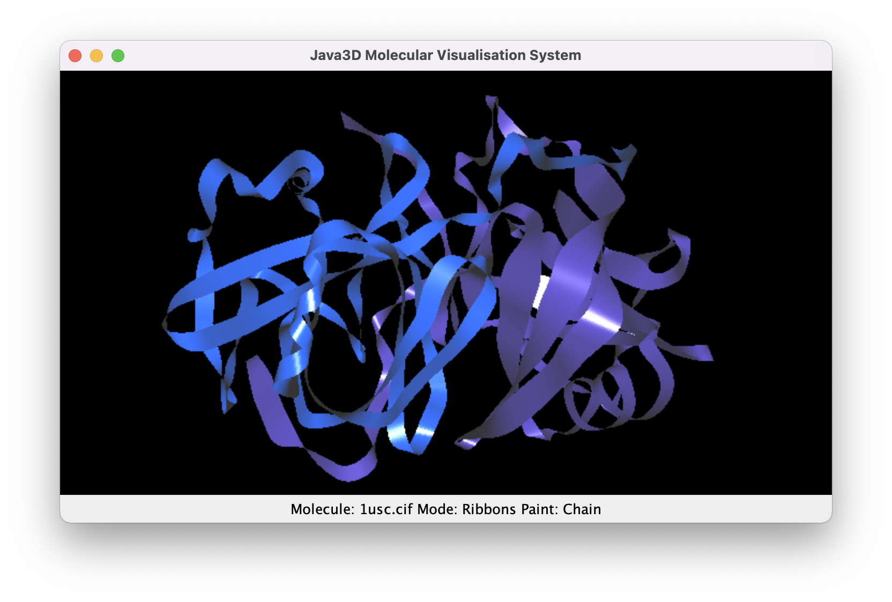

# Java3D Molecular Visualisation System (JMVS)

## 1999

JMVS was built back in 1998/99 for my Computer Science dissertation whose aim was to create 
a [RasMol](http://www.openrasmol.org/)-like 3D molecular viewer in Java. Java3D had just come about which abstracted 
low level OpenGL to a more abstract Scene Graph approach, though lower level primatives were possible. 

I recall RasMol's source code, written in C, being quite difficult to understand in detail 
(perhaps why I am now a huge proponent of code commenting, self-explanatory variable naming etc.), though I'd never 
seen C before either, my degree focusing mainly on Java, and so that was half the battle. 

However, I managed to find a way through to creating a tool that allowed for 3 graphics modes; balls, sticks and balls 
and sticks, and amino and atom colouring, with zoom and rotation. Performance was an issue once atom count got to, 
I recall, around 1000.

## 2003

A few years later in 2003, having worked professionally as a Java developer, I refactored the source code 
around a plugin-oriented idea, more configurable, though never took this idea to its full extent, i.e. 3rd parties
being able to drop in plugin jars containing new modes/colouring, for instance.

I also finally added ["ribbons"](https://en.wikipedia.org/wiki/Ribbon_diagram) mode, based on 
Mike Carson and Charles E Bugg's (Algorithm for ribbon models of proteins)[https://www.sciencedirect.com/science/article/abs/pii/0263785586800108] 
which I never quite managed for the dissertation version.

JMVS never achieved the performance or feature set of RasMol or other software in this space, but it was a project 
that helped me learn some biochemistry, some C, 3D programming and creating a desktop software user experience, 
which were all very interesting and informative.

## 2014

For fun, I decided to learn Swift with its 3D SceneKit library and ported some of JMVS to 
[iMVS](https://github.com/PorridgeBear/imvs), which has a roadmap that perhaps one day I'll tinker with further.

## 2022

Recently, I found the refactored Java source code on a hard drive and thought I'd upload it to my github account 
for posterity. Before doing that though I wanted to ensure it built and ran. 

Getting the sources to build and run on my Apple M1 with ARM processor was a headache but I managed to find some JARs
that somebody had compiled for the M1.

I added a basic gradle configuration to be able to easily build and run the sources.

To build:

	gradle build

To run:

	gradle run

Note, you'll need to add the appropriate JARs for gluegen and jogl for your architecture to app/libs.

### New additions

I also couldn't resist doing some tinkering (helps with some Java practice):

* The molecular loader has been replaced with an all-new loader for the latest PDBx/mmCIF type and loads atoms, sheets and helices
* I improved the auto-covalent bond routine to match RasMol's implementation
* Ribbons now has colour modes; Chain, Group and Structure - finally, and with better shading
* Ribbons helices/sheet size improvements, though not yet arrow shapes for sheets
* Added chain and structure colouring to balls and sticks modes

### The Java

The majority of Java here is quite old, pre-8 style. I'd like to update to more modern Java, though Java 11 appears to 
be the latest that will support the JARs that are provided here. 